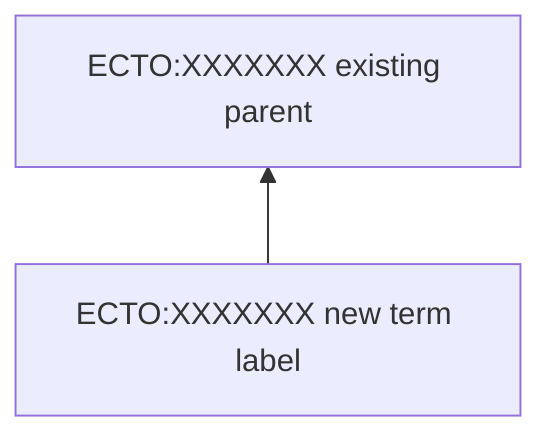

# Analyse ECTO GitHub Issue

Analyse the ECTO GitHub issue specified by the user. Follow these steps carefully.

## Step 1: Retrieve the Issue

```bash
gh issue view [NUMBER] --repo EnvironmentOntology/environmental-exposure-ontology
```

Read the full issue text, all comments, and any linked issues.

## Step 2: Identify Applicable Design Patterns

Search `src/patterns/dosdp-patterns/` for patterns relevant to the issue:
```bash
ls src/patterns/dosdp-patterns/
```

For each relevant pattern, read its YAML to understand structure and requirements.

## Step 3: Search Existing Terms

Search the ontology and pattern data for related terms:
```bash
grep -rn "<search_term>" src/patterns/data/default/
grep -n "<search_term>" src/ontology/ecto-edit.owl
```

## Step 4: Generate Analysis Report

Save the report to `src/ontology/tmp/issue_[NUMBER]_analysis.md`.

### Required Report Structure

```markdown
> ⚠️ **AI-Generated Analysis** — Model: [retrieve model name programmatically, never from memory]
> Generated: [UTC timestamp from `date -u`]
> This analysis was generated automatically and requires human review before acting.

# Issue #[NUMBER] Analysis: [Issue Title]

## Summary
[1-2 sentence summary of the request]

## Validity Assessment
[Assessment of whether the requested term/change is scientifically and ontologically valid]

### Proposed Hierarchy (if applicable)

(Use bottom-up arrows; dashed lines for proposed new relationships)

## Applicable Design Pattern
[Which DOSDP pattern applies, or "none — requires manual term"]
Pattern file: `src/patterns/dosdp-patterns/PATTERN_NAME.yaml`
TSV file: `src/patterns/data/default/PATTERN_NAME.tsv`

## Proposed Term Details (if applicable)
- **Label**: [proposed label]
- **Definition**: [proposed definition with citations]
- **Parent**: [parent term ECTO:XXXXXXX]
- **Cross-references**: [CHEBI/ENVO/UBERON/etc. IDs — must be verified]
- **Synonyms**: [with sources]

## Supporting Literature
[PubMed references supporting the analysis — PMIDs verified with aurelian]

## Action Items
- [ ] [Specific actionable step]
- [ ] [Another step]

## Notes / Open Questions
[Any uncertainties or items requiring human judgement]
```

## Critical Rules

- **Never hallucinate** term labels, ECTO IDs, CHEBI IDs, ENVO IDs, or any identifiers — verify all against actual files
- **Never post** this analysis as a GitHub comment without explicit user permission
- Retrieve model name programmatically (`claude --version` or equivalent) — never hard-code it
- Generate the UTC timestamp via `date -u` at report creation time
- Maximum 125-character direct quotes from source documents; paraphrase otherwise
- Use exact quotes in quotation marks; paraphrase otherwise
- Omit implementation plans from the report — focus on analysis only

## Step 5: Present and Confirm

Present the report to the user and ask:
> "Shall I post this analysis as a comment on issue #[NUMBER]?"

Only post if the user explicitly confirms.
