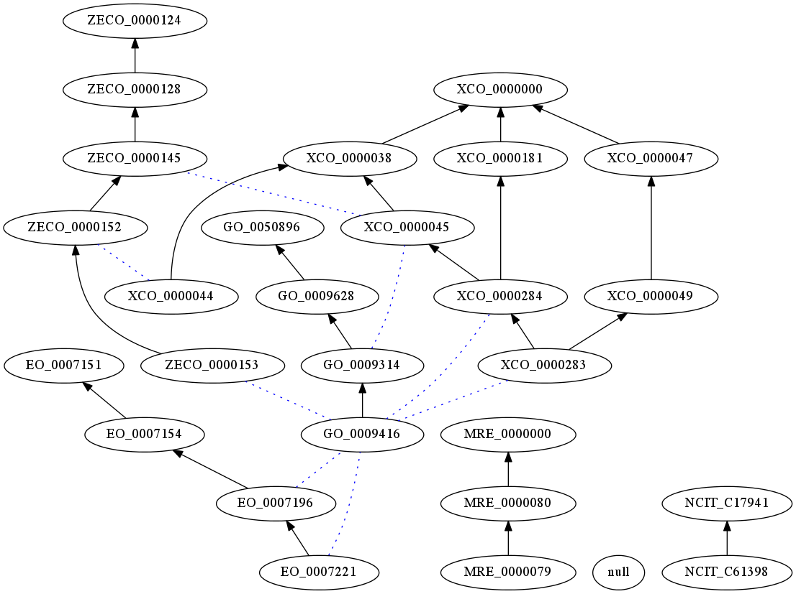

This folder serves two purposes

 * as a test of the kboom ontology merging process
 * To explore strategies the merging of multiple exposure ontologies

The ontology [merged-exposure.obo](merged-exposure.obo) contains the ontologies merged by kboom

See [rpt.md](rpt.md) for the kboom report

Example:



To run the pipeline:

```
sh run.sh make ecto.sssom.tsv -B
```

Once done, you can release the mapping file:

```
sh run.sh make release_mappings
```

Notes: 
- If you want to include SNOMED in the alignment process, you can only do that with an appropriate license. The pipeline expects the snomed.obo file in the src/ontology directory.
- run.sh is a wrapper script for the monarch `initiative/ontoml` image which is _huge_ but contains all the tools necessary for the process.
- To align with MRE, you need to have access to Monarch initiative repo. But since the ontology is not under development, it does not need to be re-run
- Currently (20 April 2021) kboom/boomer alignment does not happen, because we are waiting for a boomer feature (reporting)
